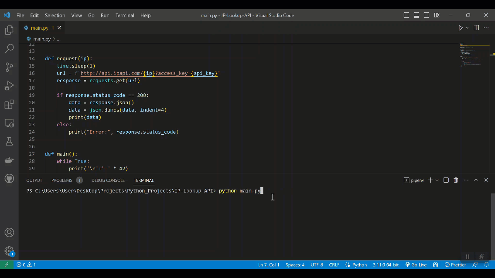
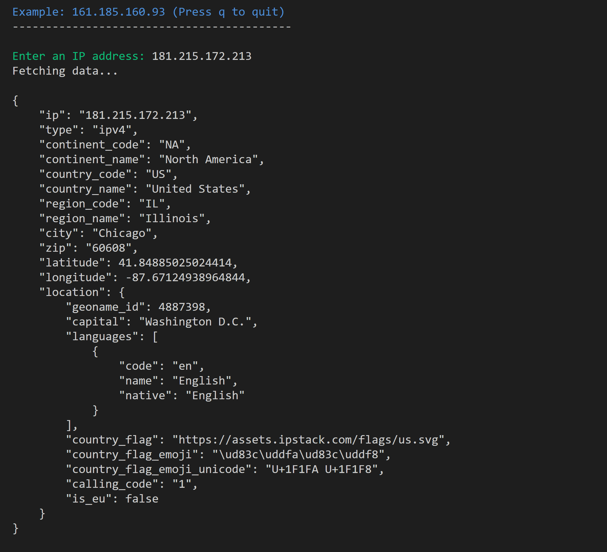

# IP API Lookup

> IPAPI provides an easy-to-use API interface allowing customers to look various pieces of information IPv4 and IPv6 addresses are associated with. For each IP address processed, the API returns more than 45 unique data points, such as location data, connection data, ISP information, time zone, currency and security assessment data.

## Demo


## Screenshot



## Usage

#
1: Install the dependencies:

```bash
pipenv install -r requirements.txt 
```

#
2: 
- Rename '.env_sample' to '.env'
- Add your API key to the .env file
- You can get your key at [https://ipapi.com/product](https://ipapi.com/product)

```bash
API ='ADD_YOUR_KEY_HERE'
```

#
3: Run server:

```bash
python main.py
```

## Options
Enter a valid IP or press q to quit


## License
MIT © iAlex0

